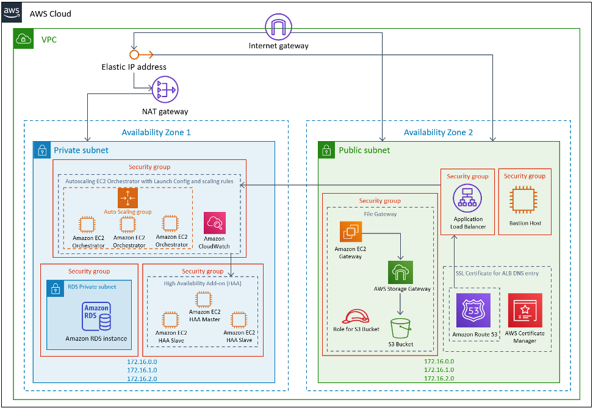

## UiPath Orchestrator on the AWS Cloud - Quick Start

This Quick Start is for users who wants to deploy UiPath Orchestrator on the AWS Cloud. It deploys UiPath Orchestrator which manages robotic automation processes, allowing users to automate attended and unattended process task within their enterprise environment. 

The [AWS CloudFormation template](https://console.aws.amazon.com/cloudformation/home?region=us-east-1#/stacks/create/template?stackName=uipath&templateURL=https://aws-quickstart.s3.amazonaws.com/quickstart-uipath-orchestrator/templates/main.template.yaml) included with the Quick Start automates deploying UiPath Orchestrator on AWS. You can also use the AWS CloudFormation template as a starting point for your own implementation.

For deploying into existing VPCs, this [AWS CloudFormation template](https://console.aws.amazon.com/cloudformation/home?region=us-east-1#/stacks/create/template?stackName=uipath&templateURL=https://aws-quickstart.s3.amazonaws.com/quickstart-uipath-orchestrator/templates/uipath-orchestrator.template.yaml) can be used as an entrypoint.

As shown in the architecture diagram, the Quick Start sets up the following:

* A highly available architecture that spans two or more Availability Zones that you choose.
* A virtual private cloud (VPC) configured with public and private subnets, according to AWS best practices, to provide you with your own virtual network on AWS.*
* In the public subnets:
  * Managed network address translation (NAT) gateways to allow outbound internet access for resources in the private subnets.*
  * A Windows bastion host to allow inbound remote desktop protocol (RDP) access to Amazon Elastic Compute Cloud (Amazon EC2) instances in private subnets.
* In the private subnets:
  * Only multi-node option for high availability is available and it creates the following:
    * Autoscaling group with up to 20 EC2 instances, based on Windows Server 2019, for Orchestrator Web app.
    * An RDS instance with SQL server for UiPath database.
    * An Application Load Balancer to balance the traffic in a Round Robin algorithm between the Orchestrator nodes.
    * High Availability Add-on for Orchestrator – a 3 nodes cluster with Linux machines, for the in-memory database that is used as shared cache by all the Orchestrator instances.
    * S3 File Storage Gateway to enable easy access to S3 files via a mapped network drive.

*The template that deploys the Quick Start into an existing VPC skips the components marked by asterisks and prompts you for your existing VPC configuration.

NOTE: You are responsible for the cost of the AWS services used while running this Quick Start. There is no additional cost for using the Quick Start.

To submit code for this Quick Start, see the [AWS Quick Start Contributor's Kit](https://aws-quickstart.github.io/).

## Notices
This document is provided for informational purposes only. It represents AWS’s current product offerings and practices as of the date of issue of this document, which are subject to change without notice. Customers are responsible for making their own independent assessment of the information in this document and any use of AWS’s products or services, each of which is provided “as is” without warranty of any kind, whether expressed or implied. This document does not create any warranties, representations, contractual commitments, conditions, or assurances from AWS, its affiliates, suppliers, or licensors. The responsibilities and liabilities of AWS to its customers are controlled by AWS agreements, and this document is not part of, nor does it modify, any agreement between AWS and its customers.

The software included with this paper is licensed under the Apache License, version 2.0 (the "License"). You may not use this file except in compliance with the License. A copy of the License is located at http://aws.amazon.com/apache2.0/ or in the accompanying "license" file. This code is distributed on an "AS IS" BASIS, WITHOUT WARRANTIES OR CONDITIONS OF ANY KIND, either expressed or implied. See the License for specific language governing permissions and limitations.

