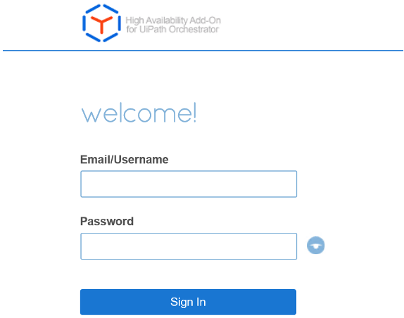

:xrefstyle: short
[#cfn_outputs2]
ifndef::partner-product-short-name[.{partner-product-name} outputs after successful deployment]
ifdef::partner-product-short-name[.{partner-product-short-name} outputs after successful deployment]
[link=images/cfn_outputs2.png]

// Add steps as necessary for accessing the software, post-configuration, and testing. Don’t include full usage instructions for your software, but add links to your product documentation for that information.
//Should any sections not be applicable, remove them
== Create a key pair

Create a key pair in your preferred region. To do this, in the navigation pane of the Amazon EC2 console, choose Key Pairs, Create Key Pair, type a name, and then choose Create.
Amazon EC2 uses public-key cryptography to encrypt and decrypt login information. To be able to log into your instances, you must create a key pair. With Windows instances, we use the key pair to obtain the administrator password via the Amazon EC2 console and then log in using Remote Desktop Protocol (RDP) as explained in the step-by-step instructions in the Amazon Elastic Compute Cloud User Guide. On Linux, we use the key pair to authenticate SSH login.

:xrefstyle: short
[#create_key_pair]
.Create key pair

== Create IAM User
To launch the Cloudformation stack for this quickstart, you’ll need to use a user login that has programmatic access to following AWS services:

["lowerroman"]
. AWS CloudFormation
. AWS IAM, Amazon EC2
. Amazon S3
. Amazon RDS
. Amazon Route53
. AWS Certificate Manager
. AWS Elastic Load Balancer
. AWS Lambda
. AWS Storage Gateway.

If you do already have an IAM user that has full access to the above services, or have Admin access, you can skip this step.

. If you do not already have such an IAM user, create an IAM user from AWS console. In the example below, a user “cfnuser” is being created allowing programmatic access and console access.
+
:xrefstyle: short
[#iam_1]
.Create IAM User

[start=2]
. In order to follow AWS best practices, allow access to the required services. In order to do so, you can choose to attach existing policies. Then type first few letters of each service name and select to choose the FullAccess roles from the filtered list. The example here shows the screen for adding AmazonEC2FullAccess.  
+
:xrefstyle: short
[#iam_2]
.Create IAM User

+
Repeat this step for all 10 services listed above.

[start=3]
. Click on Next: Tags, and optionally add a Name tag to identify the user.  
+
:xrefstyle: short
[#iam_3]
.Create IAM User

. Click on Next: Review and review to ensure that full access to all 10 listed services have been granted to the user.  
+
:xrefstyle: short
[#iam_4]
.Create IAM User
image::../images/iam_4.png[IAM,width=100%,height=100%]

. Click on Create User to have the user created, and finally download the credential as CSV and store it in a secure location for future referral, if needed.
+
:xrefstyle: short
[#iam_5]
.Create IAM User

== Purchase UiPath License

This Quick Start uses AWS owned AMI. However, during initiation of EC2 VMs, it downloads, installs and configures UiPath Orchestrator and HA Addon software. In order to do so, you need to first purchase the license keys by https://www.uipath.com/company/contact-us[contacting UiPath directly].

== Test the deployment
// If steps are required to test the deployment, add them here. If not, remove the heading
Check if the Orchestrator was deployed successfully accessing the ALB endpoint URL. The result should look lke <<test1>> below

:xrefstyle: short
[#test1]
.Test the deployment

Check if HAA nodes were deployed successfully accessing any endpoint IP via https://haa-ip:8443 from the Bastion host, then look at the tab nodes and check if all nodes are present.

:xrefstyle: short
[#test2]
.Test the deployment

:xrefstyle: short
[#test3]
.Test the deployment

Check if Orchestrator can upload to S3 bucket via FileGateway server.

Login to Orchestrator accessing the ALB endpoint URL with the specified credentials at the deployment, select Packages> Upload button > Select a NuGet package and press the Upload Button.

:xrefstyle: short
[#test4]
.Test the deployment

// == Post-deployment steps
// If post-deployment steps are required, add them here. If not, remove the heading

== Best practices for using {partner-product-short-name} on AWS
// Provide post-deployment best practices for using the technology on AWS, including considerations such as migrating data, backups, ensuring high performance, high availability, etc. Link to software documentation for detailed information.

=== High Availability and Disaster Recovery
Amazon EC2 provides the ability to place instances in multiple locations composed of AWS Regions and Availability Zones. Regions are dispersed and located in separate geographic areas. Availability Zones are distinct locations within a Region that are engineered to be isolated from failures in other Availability Zones and that provide inexpensive, low-latency network connectivity to other Availability Zones in the same Region.

By launching your instances in separate Regions, you can design your application to be closer to specific customers or to meet legal or other requirements. By launching your instances in separate Availability Zones, you can protect your applications from the failure of a single location. Exchange provides infrastructure features that complement the high availability and disaster recovery scenarios supported in the AWS Cloud.

The architecture built by this Quick Start supports AWS best practices for high availability and security.

=== Automatic Failover
Deploying this Quick Start with the *default parameters* configures an Autoscaling Group with Orchestrator Instances with 3 HAA clustered nodes or EC2 Instances for Robot solution

The Quick Start implementation supports the following scenarios:

* Protection from the failure of a single instance
* Automatic failover between the HAA cluster nodes
* Automatic failover between Availability Zones

However, the Quick Start default implementation doesn’t provide automatic failover in every case. For example, the loss of Availability Zone 1 and Zone 2, which contains the primary and secondary HAA node, would prevent automatic failover to Availability Zone 3. This is because the cluster would fail as it loses quorum. In this scenario, you could follow manual disaster recovery steps that include rebuild the cluster missing nodes (at least 2 must be available) by running :
----
curl -fsSL  http://download.uipath.com/haa/get-haa.sh | bash -s -- -u username-available-node -p password-available-node -j ip-available-node
----
to restore the HAA module. As a last resort, even if all nodes are lost, you can rebuild the entire HAA cluster and the in-memory database is regenerated from SQL DB.

The Quick Start also provides an option to deploy into minimum two Availability Zones. This deployment option can mitigate the loss of quorum in the case of a failure of a single node. However, you can select this option only in AWS Regions that include two or more Availability Zones; for a current list, see https://aws.amazon.com/about-aws/global-infrastructure/[AWS Global Infrastructure].

We recommend that you consult the https://docs.uipath.com/[UiPath docs] and customize some of the steps described in this guide or add ones to deploy a solution that best meets your business, IT, and security requirements.

Due to Autoscaling Group, Autoscaling Group rules (CloudWatch rules) and Launch Config, if any instance of Orchestrator is down, another one is being created in the desired state as long as Nuget packages are stored in S3 or any shared storage and DB is RDS type.

== Security
// Provide post-deployment best practices for using the technology on AWS, including considerations such as migrating data, backups, ensuring high performance, high availability, etc. Link to software documentation for detailed information.

=== Security Groups and Firewalls
When the EC2 instances are launched, they must be associated with a security group, which acts as a stateful firewall. You have complete control over the network traffic entering or leaving the security group, and you can build granular rules that are scoped by protocol, port number, and source or destination IP address or subnet. By default, all traffic egressing a security group is permitted. Ingress traffic, on the other hand, must be configured to allow the appropriate traffic to reach your instances.

We recommend that you tightly control ingress traffic, so that you reduce the attack surface of your EC2 instances but allowing following ports open for application communication:

*HAA*

:xrefstyle: short
[#security1]
.Security

==== Orchestrator and Robot Ports
80, 443 for instances behind ALB

443 for ALB and Robots

3389 for Robots and Orchestrators

==== Other Ports and usage:
22 for SSH into HAA nodes

1433 for MSSQL 

==== EC2 Storage Gateway Ports:
2049, 111, 20048, 35790, 49000, 54524 – NFS service

For UiPath Orchestrator security best practices, refer to https://docs.uipath.com/orchestrator/docs/security-best-practices[UiPath docs]

== Other useful information
//Provide any other information of interest to users, especially focusing on areas where AWS or cloud usage differs from on-premises usage.

AWS provides a set of building blocks (for example, Amazon EC2 and Amazon VPC) that you can use to provision infrastructure for your applications. In this model, some security capabilities, such as physical security, are the responsibility of AWS and are highlighted in the AWS security whitepaper. Other areas, such as controlling access to applications, fall on the application developer and the tools provided in the Microsoft or Linux (RHEL) ecosystem.

This Quick Start configures the following security groups for UiPath Stack (Robot or Orchestrator):

[cols="20s,20,20,40",grid=rows,frame=topbot, options="header"]
|===
|Security group
|Associated with
|Inbound source
|Ports
|autoscaling-group-security-group
|ASG
|Private subnets CIDR
|Inbound: 80, 443, 3389 +
Outbound : any ports
|db-security-group
|MSSQL or RDS
|Private subnets CIDR
|Inbound: 1433 +
Outbound: any ports
|bastion-security-group
|Bastion Host
|0.0.0.0/0
|Inbound: 3389 +
Outbound: any ports
|filegateway-security-group
|FileGateway
|VPC CIDR, Security CIDR block
|Inbound: 2049, 111, 20048, 80, 35790, 49000, 54524, 55481 +
Outbound: any ports
|haa-security-group
|HAA cluster
|Private subnets CIDR +
VPC CIDR, Security CIDR block
|Inbound: 22,8443, 80, 443,9443,1968,3333-3339, 36379-36380, 8001, 9443,8444, 9080, 9081, 8070-8071, 10000-19999, 20000-29999, 53, 5353 +
Outbound: any ports
|alb-security-group
|Load balancer
|0.0.0.0/0
|Inbound: 443 +
Outbound: 80, 443
|===

