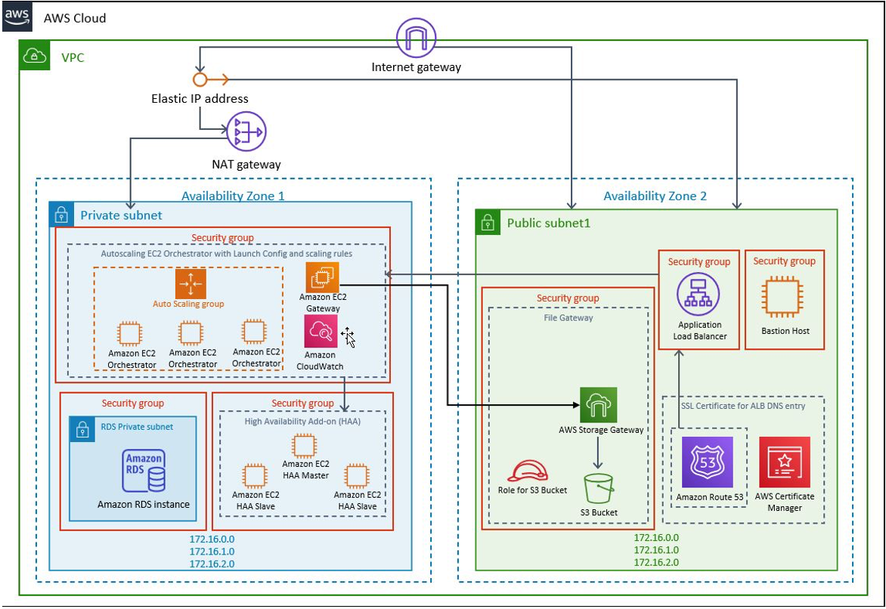

Deploying this Quick Start for a new virtual private cloud (VPC) with
default parameters builds the following {partner-product-short-name} environment in the
AWS Cloud.

// Replace this example diagram with your own. Send us your source PowerPoint file. Be sure to follow our guidelines here : http://(we should include these points on our contributors giude)
:xrefstyle: short
[#architecture1]
.Quick Start architecture for {partner-product-short-name} on AWS

As shown in <<architecture1>>, the Quick Start sets up the following:

* A highly available architecture that spans two Availability Zones.*
* A VPC configured with public and private subnets, according to AWS
best practices, to provide you with your own virtual network on AWS.*
* In the public subnets:
** Managed network address translation (NAT) gateways to allow outbound
internet access for resources in the private subnets.*
** A Windows bastion host to allow inbound RDP access to EC2 instances in private subnets.
** S3 bucket for storage of the NuGet packages (the automations that are executed by the robots are delivered through Orchestrator)
* In the private subnets:
** Only multi-node option for high availability is available and it creates the following:
*** Autoscaling group with up to 20 EC2 instances, based on Windows Server 2019, for Orchestrator Web app
*** An RDS instance with SQL server for UiPath database
*** An Application Load Balancer to balance the traffic in a Round Robin algorithm between the Orchestrator nodes
*** High Availability Add-on for Orchestrator – a 3 nodes cluster with Linux machines, for the in-memory database that is used as shared cache by all the Orchestrator instances
*** S3 File Storage Gateway to enable easy access to S3 files via a mapped network drive
