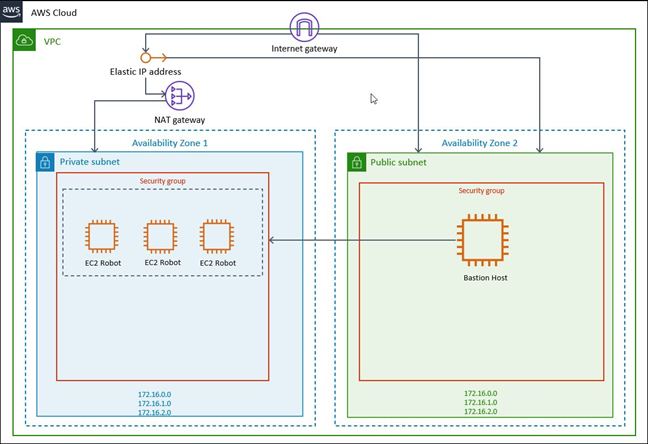

# quickstart-uipath-robot
## UIPath Robot on AWS Cloud

This Quick Start reference deployment guide provides step-by-step instructions for deploying UiPath Robot on AWS Cloud.

This Quick Start is for users who wants to deploy UiPath Robot application on AWS cloud. It deploys UiPath Robot which helps with robotic automation processes, allowing users to automate attended and unattended process task within their enterprise environment. 

The AWS CloudFormation templates included with the Quick Start automate the following:

- [Deploying the UiPath Robot on AWS Cloud](https://console.aws.amazon.com/cloudformation/home?region=us-east-1#/stacks/create/template?stackName=uipath&templateURL=https://aws-quickstart.s3.amazonaws.com/quickstart-uipath-robot/templates/main.template.yaml)

You can also use the AWS CloudFormation templates as a starting point for your own implementation.

