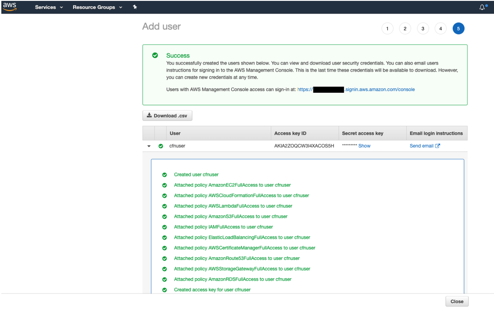

// Add steps as necessary for accessing the software, post-configuration, and testing. Don’t include full usage instructions for your software, but add links to your product documentation for that information.
//Should any sections not be applicable, remove them

== Test the deployment
// If steps are required to test the deployment, add them here. If not, remove the heading
If you have provided an Orchestrator URL then login to Orchestrator and check if the Robot is present in the tenant provided and connected.
:xrefstyle: short
[#test1]
.Test the deployment

[NOTE]
====
The deployment will create a new MODERN folder called AWSDeployed. In it you will find the newly created UiPath Robot. 

Depending on the type of the Robot you selected you will encounter the following situations:

* For Unattended robot, be aware that the STATUS will be N/A but you will be able to run jobs on the machine. This happens because the new local admin account created by the deployment is not logged into the machine. 
* For Attended Robot the STATUS will be DISCONNECTED because the built-in Administrator account is not logged into the machine.
====

Check if the Robot was deployed successfully by accessing the Robot VM from the Bastion Host. 
[NOTE]
==== 
For Attended Robot connect with the Administrator account. You will retrieve the password for the AWS portal by using your private key mentioned in the deployment.

For Unattended Robot, you will retrieve the user account from the Robots page in Orchestrator. The user format is: domain/username OR machinename/username. The password is the one you provided in the deployment at the UiPath Robot Configuration step.
====

The result should like like <<test2>>

:xrefstyle: short
[#test2]
.Test the deployment

// == Post-deployment steps
// If post-deployment steps are required, add them here. If not, remove the heading

== Best practices for using {partner-product-short-name} on AWS
// Provide post-deployment best practices for using the technology on AWS, including considerations such as migrating data, backups, ensuring high performance, high availability, etc. Link to software documentation for detailed information.

=== High Availability and Disaster Recovery
Amazon EC2 provides the ability to place instances in multiple locations composed of AWS Regions and Availability Zones. Regions are dispersed and located in separate geographic areas. Availability Zones are distinct locations within a Region that are engineered to be isolated from failures in other Availability Zones and that provide inexpensive, low-latency network connectivity to other Availability Zones in the same Region.

By launching your instances in separate Regions, you can design your application to be closer to specific customers or to meet legal or other requirements. By launching your instances in separate Availability Zones, you can protect your applications from the failure of a single location. Exchange provides infrastructure features that complement the high availability and disaster recovery scenarios supported in the AWS Cloud.

The architecture built by this Quick Start supports AWS best practices for high availability and security.

The Quick Start also provides an option to deploy into minimum two Availability Zones. This deployment option can mitigate the loss of quorum in the case of a failure of a single node. However, you can select this option only in AWS Regions that include two or more Availability Zones; for a current list, see https://aws.amazon.com/about-aws/global-infrastructure/[AWS Global Infrastructure].

We recommend that you consult the https://docs.uipath.com/[UiPath docs] and customize some of the steps described in this guide or add ones to deploy a solution that best meets your business, IT, and security requirements.

== Security
// Provide post-deployment best practices for using the technology on AWS, including considerations such as migrating data, backups, ensuring high performance, high availability, etc. Link to software documentation for detailed information.

When the EC2 instances are launched, they must be associated with a security group, which acts as a stateful firewall. You have complete control over the network traffic entering or leaving the security group, and you can build granular rules that are scoped by protocol, port number, and source or destination IP address or subnet. By default, all traffic egressing a security group is permitted. Ingress traffic, on the other hand, must be configured to allow the appropriate traffic to reach your instances.

We recommend that you tightly control ingress traffic, so that you reduce the attack surface of your EC2 instances but allowing following ports open for application communication:

Robot

:xrefstyle: short
[#security1]
.Test the deployment

[cols="20,80",grid="rows",frame="topbot" caption=]
.Robot Ports
|===
|3389
|RDP access

|443
|communication with Orchestrator
|===

For UiPath Orchestrator security best practices, do refer to https://docs.uipath.com/orchestrator/docs/security-best-practices[UiPath docs]

== Other useful information
//Provide any other information of interest to users, especially focusing on areas where AWS or cloud usage differs from on-premises usage.

AWS provides a set of building blocks (for example, Amazon EC2 and Amazon VPC) that you can use to provision infrastructure for your applications. In this model, some security capabilities, such as physical security, are the responsibility of AWS and are highlighted in the AWS security whitepaper. Other areas, such as controlling access to applications, fall on the application developer and the tools provided in the Microsoft or Linux (RHEL) ecosystem.

This Quick Start configures the following security groups for UiPath Stack (Robot or Orchestrator):

[cols="25,25,25,25",grid="rows",frame="topbot", options="header"]
|===
|Security group
|Associated with
|Inbound source
|Ports

|StackName-SecurityStack-RobotSecurityGroup
|Robots
|0.0.0.0/0
|Inbound: 443, 3389 +
Outbound: any ports
|===

== Create a key pair

. Create a https://docs.aws.amazon.com/AWSEC2/latest/UserGuide/ec2-key-pairs.html[key pair] in your preferred region. To do this, in the navigation pane of the Amazon EC2 console, choose *Key Pairs, Create Key Pair*, type a name, and then choose *Create.*

Amazon EC2 uses public-key cryptography to encrypt and decrypt login information. To be able to log into your instances, you must create a key pair. With Windows instances, we use the key pair to obtain the administrator password via the Amazon EC2 console and then log in using Remote Desktop Protocol (RDP) as explained in the https://docs.aws.amazon.com/AWSEC2/latest/UserGuide/ec2-key-pairs.html#having-ec2-create-your-key-pair[step-by-step instructions] in the _Amazon Elastic Compute Cloud User Guide._ On Linux, we use the key pair to authenticate SSH login.

:xrefstyle: short
[#ds1]
.Create a Key Pair

== Create an IAM User

To launch the Cloudformation stack for this quickstart, you’ll need to use a user login that has programmatic access to following AWS services:

[lowerroman]
. AWS CloudFormation
. AWS IAM, Amazon EC2
. Amazon S3
. AWS Lambda
. AWS Storage Gateway.

If you do already have an IAM user that has full access to the above services, or have Admin access, you can skip this step.

. If you do not already have such an IAM user, create an IAM user from AWS console. In the example below, a user “cfnuser” is being created allowing programmatic access and console access.
+
:xrefstyle: short
[#ds2]
.Create an IAM User
image::../images/ds2.png[ds2,width=100%,height=100%]
+
. In order to follow AWS best practices, allow access to the required services. In order to do so, you can choose to attach existing policies. Then type first few letters of each service name and select to choose the FullAccess roles from the filtered list. The example here shows the screen for adding AmazonEC2FullAccess.  
+
:xrefstyle: short
[#ds3]
.Create an IAM User

+
Repeat this step for all 10 services listed above.
+
. Click on Next: Tags, and optionally add a Name tag to identify the user.
+  
:xrefstyle: short
[#ds4]
.Create an IAM User

+
. Click on Next: Review and review to ensure that full access to all 10 listed services have been granted to the user.  
+
:xrefstyle: short
[#ds5]
.Create an IAM User

+
. Click on Create User to have the user created, and finally download the credential as CSV and store it in a secure location for future referral, if needed.
+
:xrefstyle: short
[#ds6]
.Create an IAM User

